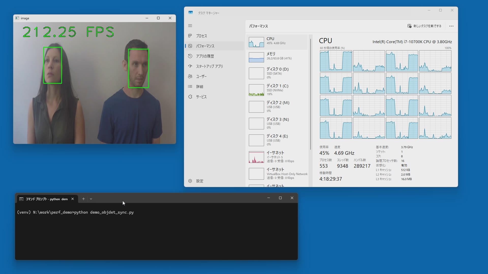
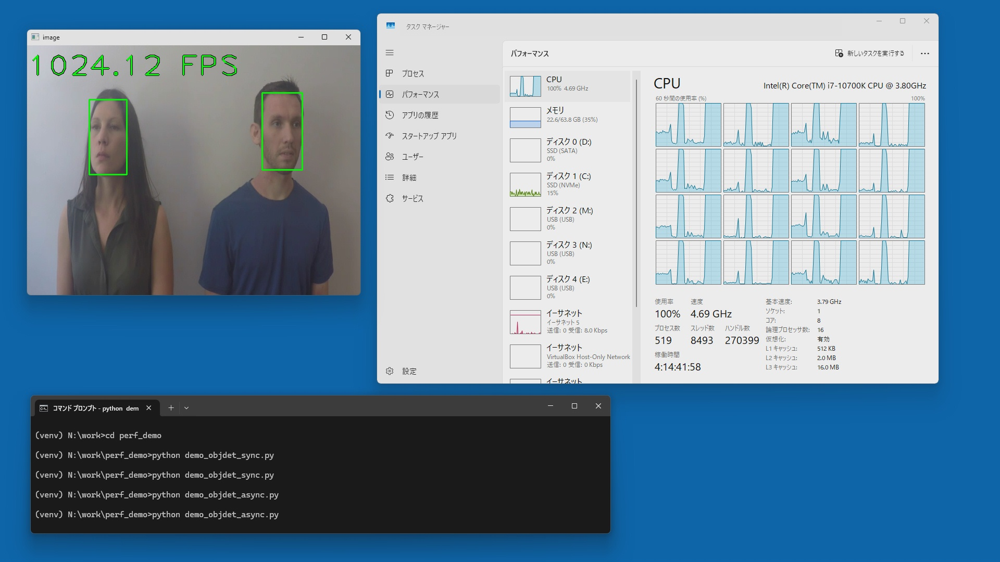

# OpenVINO asynchronous inference performance demo

## Description
OpenVINO Toolkit supports both synchronous and asynchronous inference APIs.  
The synchronous (blocking) inference API is easy to use, but it can leverage only a small fraction of the processor's performance.  
You can utilize full processor performance with the asynchronous inference API.  

Asynchronous inference is also essential when you use a DL accelerator such as an integrated GPU or NPU. If you use the synchronous inference API for accelerators, **the CPU just waits until the inference on the accelerator is completed. It's just a waste of CPU time.**

This project demonstrates the difference in inference performance between synchronous API and asynchronous API.
This demo program uses a callback function and multiple threads to utilize the highest possible advantage of asynchronous inference.
```python
# callback function to receive the asynchronous inference result
def callback(self, request, userdata):      # userdata == input image for inferencing
    res = list(request.results.values())[0]
    if time.perf_counter() - self.time_last_callback < 1/30:        # submit the result to the rendering thread every 1/30 sec only
        return
    self.time_last_callback = time.perf_counter()
    self.queue_inference_result.put((res, userdata))
```

Also, setting appropriate performance parameters and hints is critical for the best performance.
```python
# OpenVINO performance optimize parameters and hints
config={'CACHE_DIR':'./cache'}
config.update({hints.performance_mode: hints.PerformanceMode.THROUGHPUT})
config.update({hints.num_requests:"32"})            # number of request queue
config.update({props.inference_num_threads: "16"})  # number of thread used by OpenVINO runtime
config.update({props.num_streams: "8"})             # number of simultaneous inference request execution
```
## Screen capture of the demo

config = Core i7-10700K, Mem 64GB, Win11, OpenVINO 2025.0

### Synchronous API (device=CPU) - 212fps
CPU utilization is 45%  
**Note:** The initial version had 60fps performance. The fps performance improved after I changed the program to update the screen every 1/30sec only (reducing the screen update burden).



### Acynshronous API (device=CPU) - 1,024fps (x4.8 to sync)
CPU utilization is 100%.


## Reference

- [Image Classification Async Sample](https://docs.openvino.ai/2025/get-started/learn-openvino/openvino-samples/image-classification-async.html)

- [OpenVINO™ Runtime Python API Advanced Inference](https://docs.openvino.ai/2025/openvino-workflow/running-inference/integrate-openvino-with-your-application/python-api-advanced-inference.html)

- [API: openvino.AsyncInferQueue](https://docs.openvino.ai/2025/api/ie_python_api/_autosummary/openvino.AsyncInferQueue.html)

- [High-level Performance Hints](https://docs.openvino.ai/2025/openvino-workflow/running-inference/optimize-inference/high-level-performance-hints.html)